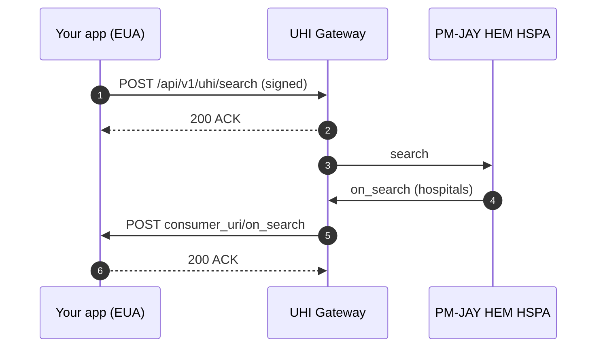

# Quick start: find a PM-JAY hospital near you

Send one GPS search to the sandbox [UHI Gateway](/docs/uhi/v1/getting-started/glossary#uhi-gateway) and receive PM-JAY empanelled hospitals within a radius, on your callback URL. The exchange touches every part of the [UHI](/docs/uhi/v1/getting-started/glossary#uhi) network with the smallest payload: signing, the Gateway, an [HSPA](/docs/uhi/v1/getting-started/glossary#hspa) and an asynchronous callback.

## In short

- Expose `POST <consumer_uri>/on_search` and have it return `ACK` at once.
- Build a PM-JAY HEM search with GPS and a radius. It needs no state.
- Sign it with the Header Generation Utility and send it byte for byte.
- The `200 ACK` is only a receipt. The hospitals arrive on your callback.



## Prerequisites

- Sandbox registration done, with your subscriber ID and public key ID. See [Onboarding](/docs/uhi/v1/getting-started/onboarding).
- Your private key.
- A public HTTPS URL for callbacks.

## 1. Stand up a callback

Expose `POST <your consumer_uri>/on_search`. It must reply `200` with this body immediately, then store the request for you to inspect:

```json
{ "message": { "ack": { "status": "ACK" } }, "error": {} }
```

## 2. Build the search

Save this as `search.json`. Use a new UUID and the current UTC time. Put your own IDs in `consumer_id` and `consumer_uri`. The coordinates are Hyderabad; replace them with yours.

```json
{
  "context": {
    "domain": "nic2004:85112",
    "country": "IND",
    "city": "std:011",
    "action": "search",
    "core_version": "0.7.1",
    "consumer_id": "<YOUR_SUBSCRIBER_ID_FROM_SANDBOX_REGISTRATION>",
    "consumer_uri": "<YOUR_HTTPS_CALLBACK_BASE_URL>",
    "message_id": "<NEW_UUID>",
    "transaction_id": "<SAME_UUID_AS_MESSAGE_ID>",
    "timestamp": "<NOW_IN_UTC_ISO_8601>"
  },
  "message": {
    "intent": {
      "fulfillment": {
        "type": "PMJAYHEM",
        "start": { "time": { "timestamp": "<TODAY>T00:00:00" } },
        "end": { "time": { "timestamp": "<TODAY>T23:59:59" } }
      },
      "item": { "descriptor": { "code": "PMJAY", "name": "PMJAY", "flag": false } },
      "location": {
        "gps": "17.3787973,78.4368433",
        "radius": { "type": "CONSTANT", "value": "13.0", "unit": "km" }
      }
    }
  }
}
```

Every field in `context` is explained on [Messages and callbacks](/docs/uhi/v1/concepts/messages#the-context-block).

## 3. Sign it

Run the [Header Generation Utility](https://github.com/NHA-ABDM/UHI/tree/main/header_generator_utility) with your subscriber ID, your public key ID and the payload above as an exact string. It returns the signed header values.

Send the body byte for byte as you signed it. Reformatting it breaks the digest. See [Signing](/docs/uhi/v1/concepts/signing).

## 4. Send it

```bash
curl -X POST https://uhigatewaysandbox.abdm.gov.in/api/v1/uhi/search \
  -H "Content-Type: application/json" \
  -H 'Authorization: <SIGNED_HEADER_FROM_THE_HEADER_GENERATION_UTILITY>' \
  -H 'Digest: BLAKE-512=<DIGEST_FROM_THE_HEADER_GENERATION_UTILITY>' \
  --data-binary @search.json
```

You receive `200` with `"ack": { "status": "ACK" }` straight away. That is only a receipt.

## 5. Read the callback

Within seconds, the Gateway posts `on_search` to your `/on_search` endpoint. Check that `context.transaction_id` matches yours, then read `message.catalog.providers[]`. Each provider looks like this. The values are illustrative, and sandbox data differs.

```json
{
  "id": "HOSP27G13867",
  "descriptor": { "name": "General Hospital Wardha", "code": "G" },
  "categories": [ { "descriptor": { "name": "Cardiology", "code": 100002 } } ],
  "fulfillments": [
    { "type": "Establishment Date", "start": { "time": { "timestamp": "1915" } } },
    { "type": "Empaneled Date", "start": { "time": { "timestamp": "2018-09-14 16:03:16.0" } } }
  ],
  "location": { "gps": "15.497097,80.048688", "district": { "name": "PRAKASAM" } },
  "contact": { "phone": "<MOBILE_NUMBER>", "tags": { "nodalOfficerNumber": "<MOBILE_NUMBER>" } }
}
```

## If it does not work

| Symptom | Likely cause |
| --- | --- |
| `401` on step 4 | Header signed over a different body, a reused or expired signature, or the wrong `keyId` |
| `403` on step 4 | Public key not registered, or registration not yet active |
| `ACK` but no callback | `consumer_uri` not publicly reachable over HTTPS, or your endpoint did not return `200` |
| Callback arrives but is not matched | Your code looked up the wrong `transaction_id` |
| Empty `providers[]` | No empanelled hospital inside the radius. Widen `radius.value` |

## Next steps

Every other service is a variation on this exchange. Discovery services change the domain and the filters. Physical Consultation and Ambulance Booking add [direct calls](/docs/uhi/v1/getting-started/glossary#direct-call-p2p) between the [EUA](/docs/uhi/v1/getting-started/glossary#eua) and the HSPA after `on_search`.

- [PM-JAY HEM](/docs/uhi/v1/services/pmjay-hem): the other filters this search takes.
- [Routes](/docs/uhi/v1/concepts/routes): what happens after `on_search` for services that book.
- [Errors](/docs/uhi/v1/concepts/errors): the error object and what to log.
